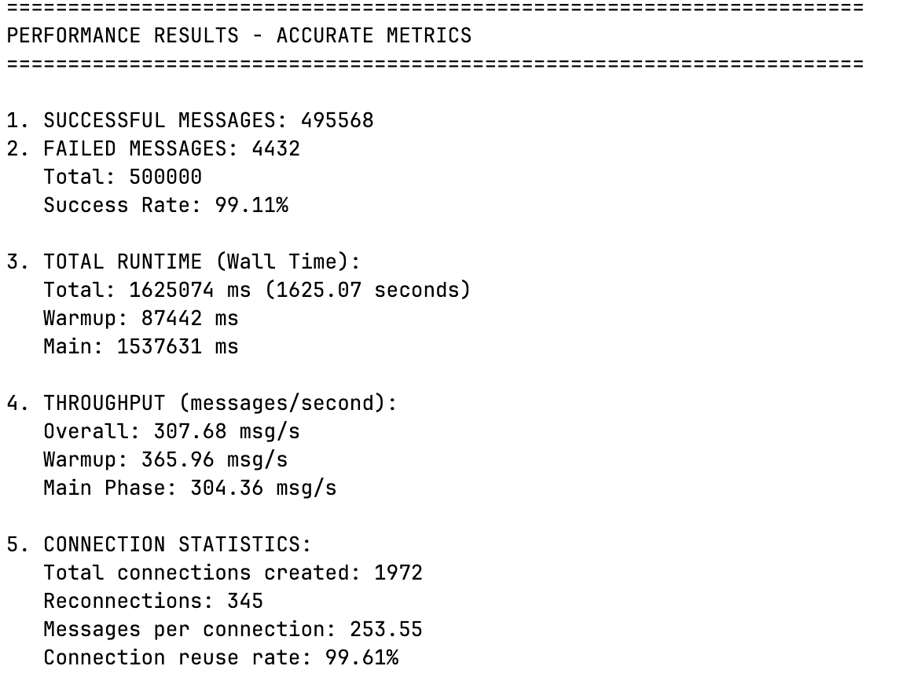
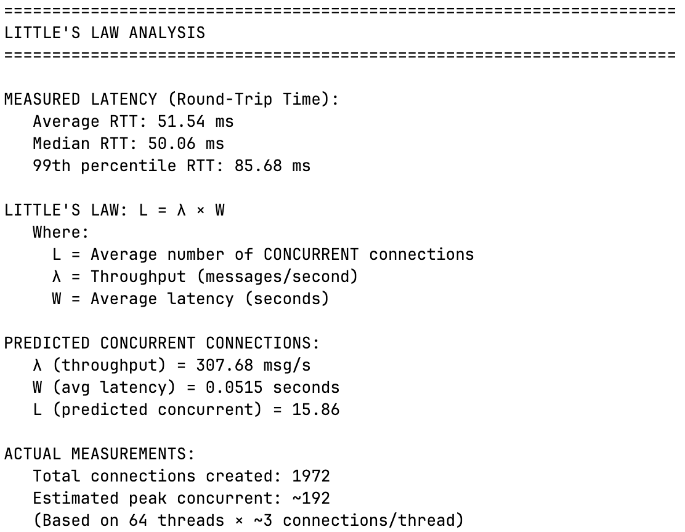
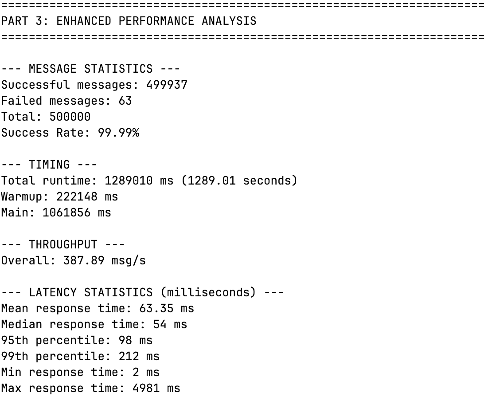
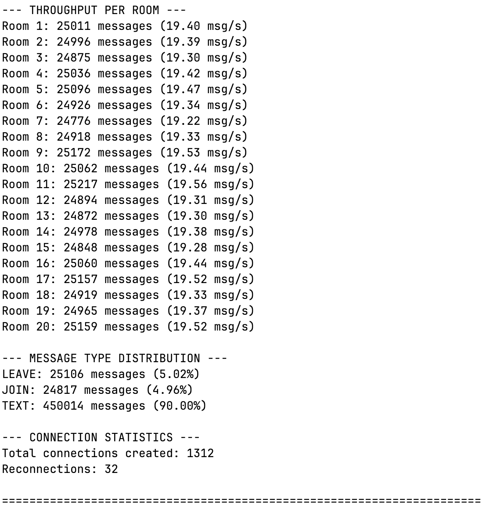
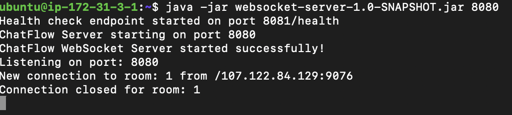
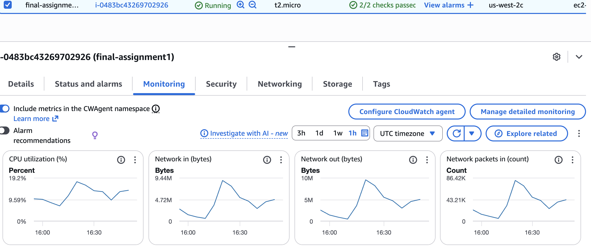
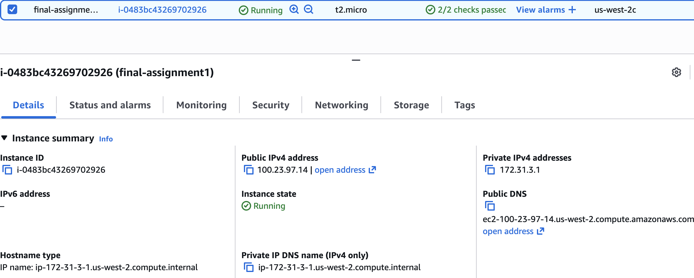

# ChatFlow WebSocket Load Testing Project

## Project Overview
High-performance WebSocket chat server and multithreaded load testing client capable of handling 500,000 messages with detailed performance analysis.

## Git Repository URL
- [`/server`](https://github.com/jason-te-sde/ChatFlow/tree/main/server) - WebSocket server implementation
- [`/client-part1`](https://github.com/jason-te-sde/ChatFlow/tree/main/client-part1) - Basic load testing client (Part 1)
- [`/client-part2`](https://github.com/jason-te-sde/ChatFlow/tree/main/client-part2) - Enhanced client with detailed metrics (Part 2)
- [`/results`](https://github.com/jason-te-sde/ChatFlow/tree/main/results) - Test results, charts, and analysis
- [`README.md`](https://github.com/jason-te-sde/ChatFlow/blob/main/README.md)
- [`Server Readme.md`](https://github.com/jason-te-sde/ChatFlow/blob/main/README.md)
- [`Client Readme.md`](https://github.com/jason-te-sde/ChatFlow/blob/main/client-part1/README.md)

## Design Document

### 1. Architecture diagram

### 2. Major Classes and Their Relationships

### 3. Threading Model Explanation

### 4. WebSocket Connection Management Strategy

### 5. Little's Law calculations and predictions
- Little's Law Formula Visualization

- Calculation Example with Actual Results

## Test Results

### Screenshot of Part 1 output (basic metrics)

### Screenshot of Part 2 output (detailed metrics)

### Performance analysis charts

### Evidence of EC2 deployment (EC2 console screenshot)

