# CS6650 Assignment 2 Submission

**Repo:** https://github.com/jason-te-sde/ChatFlow/tree/assignment2

---

## 1. Git Repository Structure

- [`/server-v2`](https://github.com/jason-te-sde/ChatFlow/tree/assignment2/server-v2) - WebSocket server with RabbitMQ producer integration
- [`/consumer`](https://github.com/jason-te-sde/ChatFlow/tree/assignment2/consumer) - Consumer application — pulls from queue and broadcasts
- [`/client`](https://github.com/jason-te-sde/ChatFlow/tree/assignment2/client)     -    Multithreaded load test client (500K / 1M messages)
- [`/deployment`](https://github.com/jason-te-sde/ChatFlow/tree/assignment2/deployment)  -   Deployment scripts and configuration guide
- [`/monitoring`](https://github.com/jason-te-sde/ChatFlow/tree/assignment2/monitoring)   -  Monitoring tools and RabbitMQ management guide

---

## 2. Architecture Document

### 2.1 System Architecture Diagram

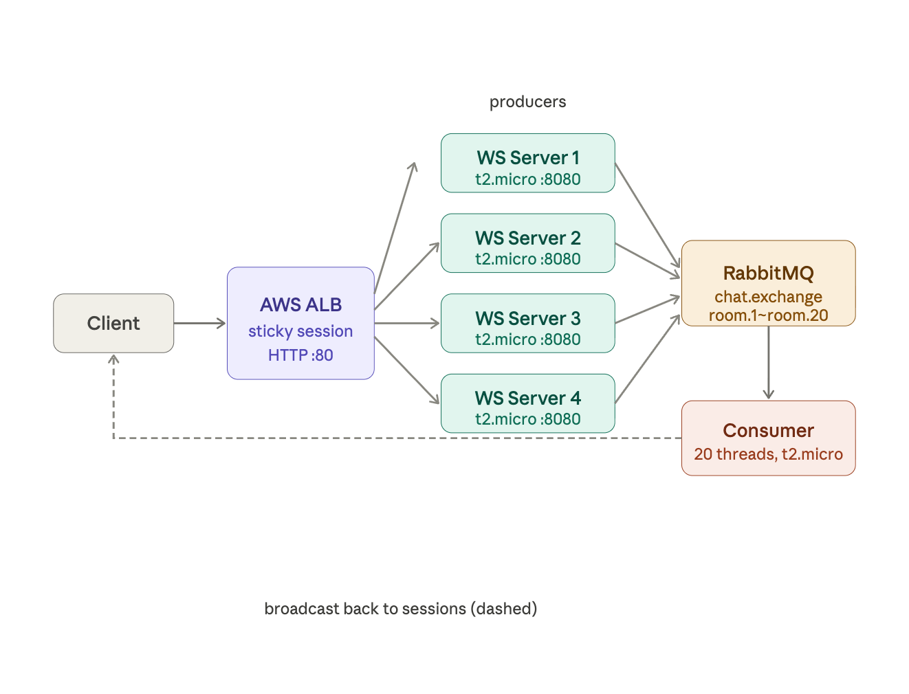

### 2.2 Message Flow Sequence Diagram

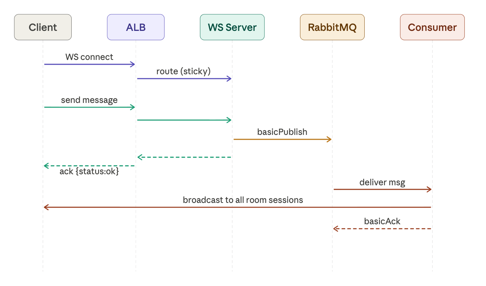

### 2.3 Queue Topology Design
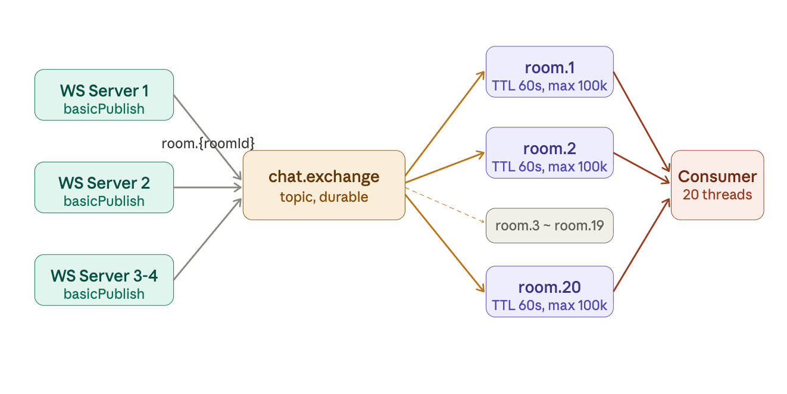

- **Exchange:** `chat.exchange`, type: `topic`, durable: `true`
- **Queues:** `room.1` through `room.20`, durable: `true`
- **Binding:** each queue bound with routing key equal to its name
- **TTL:** 60,000ms (messages expire after 60 seconds)
- **Max length:** 100,000 messages per queue
- **Prefetch:** `basicQos(100)` per consumer channel
- **Delivery:** manual ack after successful broadcast (at-least-once)

### 2.4 Consumer Threading Model
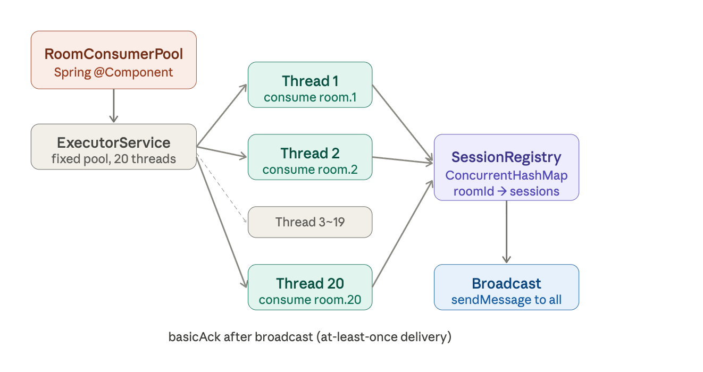

Each consumer thread:
1. Creates its own RabbitMQ connection and channel
2. Sets `basicQos(100)` to limit prefetch
3. Broadcasts each message to all sessions in the room
4. Sends `basicAck` after successful broadcast
5. Auto-restarts with 3-second backoff on connection failure

### 2.5 Load Balancing Configuration

| Setting | Value |
|---|---|
| ALB type | Application Load Balancer |
| Scheme | Internet-facing |
| Listener | HTTP:80 |
| Target protocol | HTTP:8080 |
| Health check path | `/health` |
| Health check interval | 30s |
| Healthy threshold | 2 |
| Unhealthy threshold | 3 |
| Stickiness type | Load balancer generated cookie |
| Stickiness duration | 1 day |

Sticky sessions are required because WebSocket is stateful — after the HTTP upgrade handshake, all subsequent frames must go to the same backend instance.

### 2.6 Failure Handling Strategies

| Failure Scenario | Strategy |
|---|---|
| RabbitMQ connection drop | `AutomaticRecoveryEnabled=true` on all connections |
| Consumer thread crash | `while(true)` loop with 3-second sleep and reconnect |
| WebSocket client disconnect | `handleTransportError` catches IOException silently; session removed from registry on close |
| Channel pool exhaustion | `BlockingQueue.take()` blocks caller until channel is returned |
| Queue overflow | TTL=60s and max-length=100k prevent unbounded growth |
| ALB health check failure | `/health` returns 200 immediately; 3-check threshold gives 90s grace |

---

## 3. Test Results

### 3.1 Single Instance Baseline (Local)

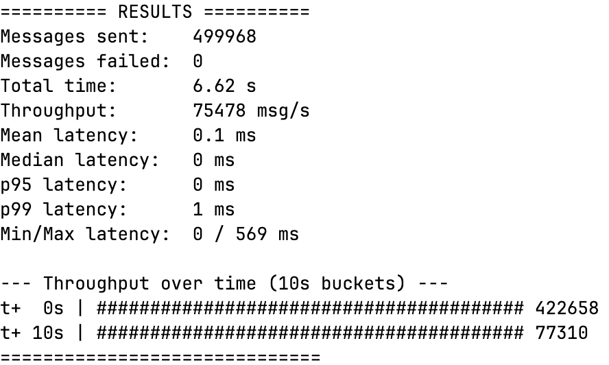

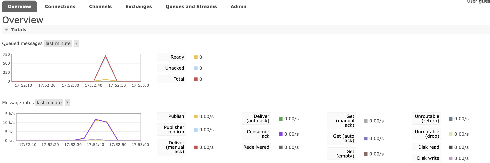

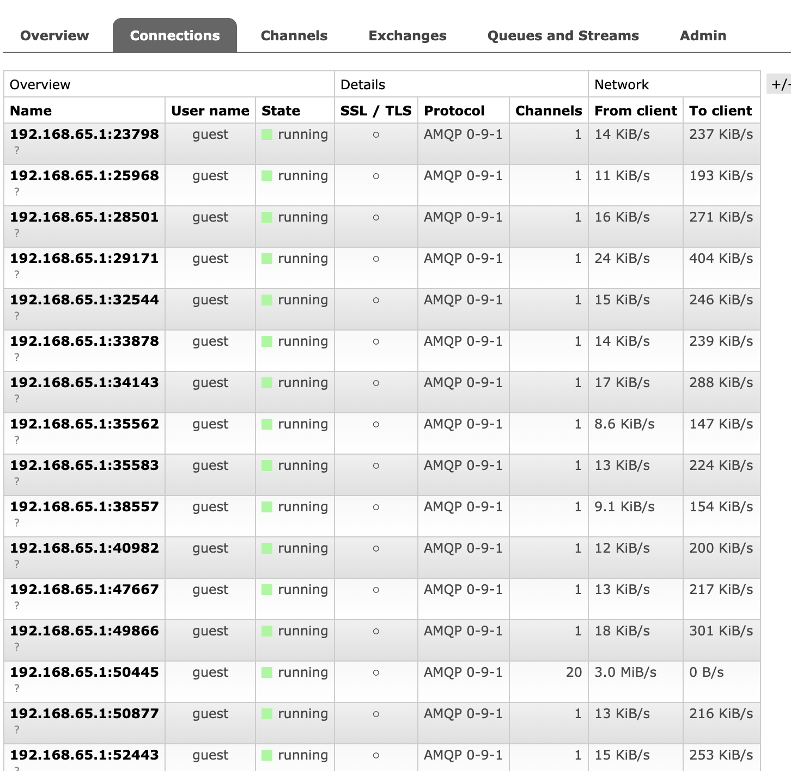

Queue depth reached a brief peak then returned to 0, indicating consumers kept pace with producers. Publish and consumer ack rates were nearly equal, confirming no message loss.

---

### 3.2 Load Balanced Test — 2 Instances

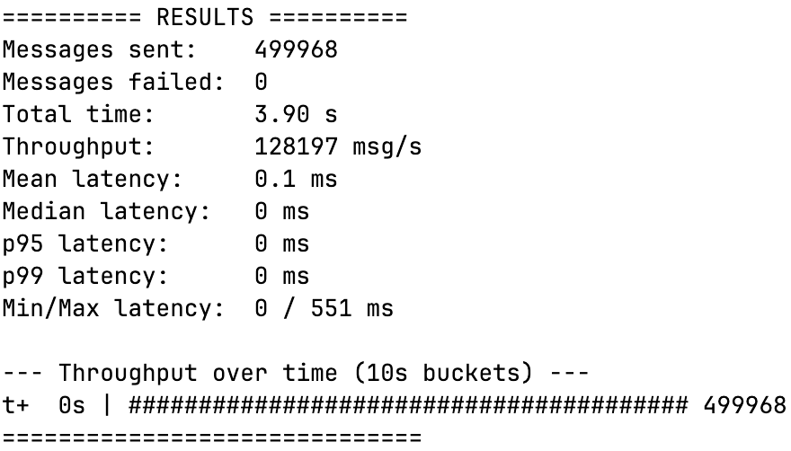

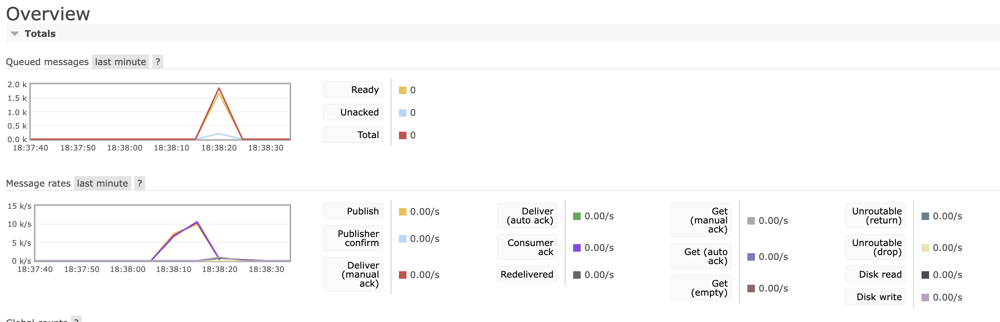

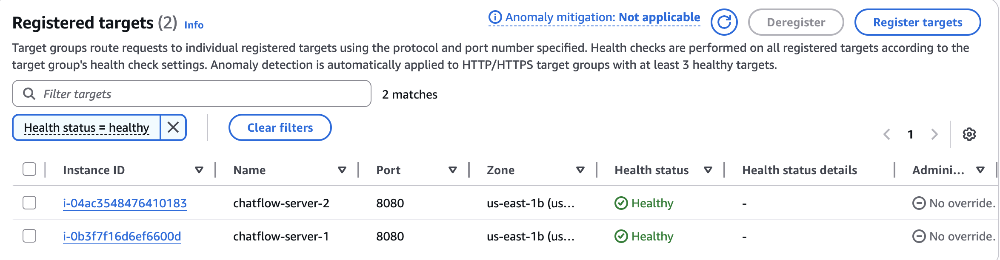

---

### 3.3 Load Balanced Test — 4 Instances (500K messages)

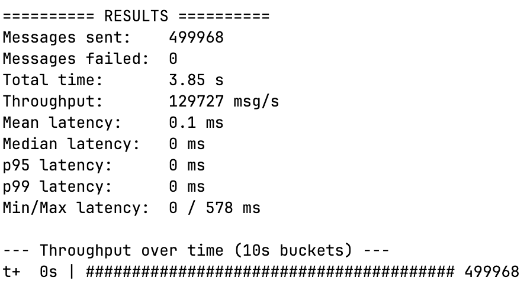

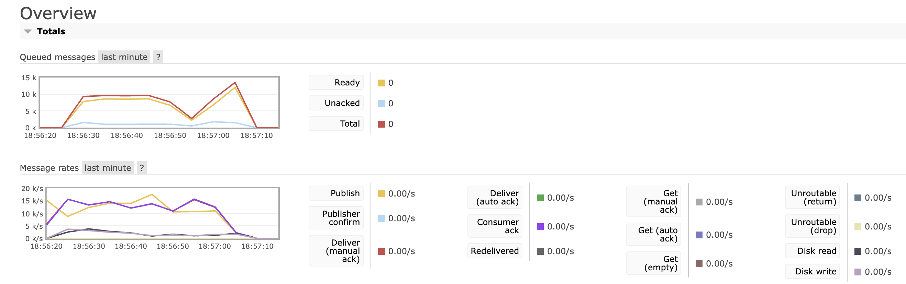

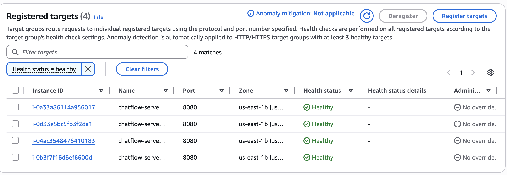

---

### 3.4 Stress Test — 4 Instances (1M messages)

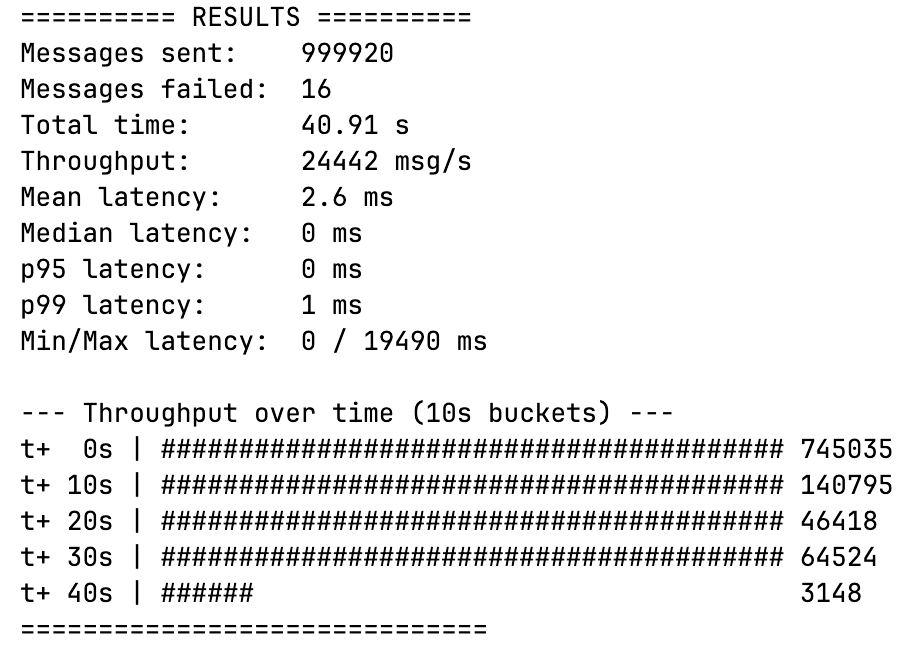

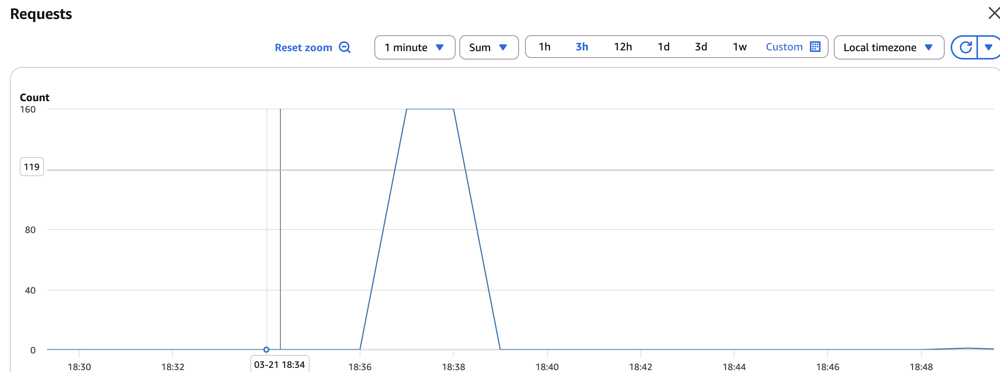

---

### 3.5 Performance Improvement Analysis

| Test | Instances | Messages | Throughput | Failed | p99 latency |
|---|---|---|---|---|---|
| Local baseline | 1 | 500K | 75,478 msg/s | 0 | 1ms |
| AWS 2-instance | 2 | 500K | 128,197 msg/s | 0 | 0ms |
| AWS 4-instance | 4 | 500K | 129,727 msg/s | 0 | 0ms |
| AWS 4-instance stress | 4 | 1M | 24,442 msg/s | 16 | 1ms |

**Key observations:**

- 2-instance AWS throughput (128K msg/s) is **1.7x** the local single-instance baseline (75K msg/s), demonstrating effective horizontal scaling.
- 4-instance throughput (129K msg/s) is similar to 2-instance, indicating the bottleneck at this scale is the **single consumer EC2 instance** and RabbitMQ, not the WebSocket servers.
- Queue depths remained stable (Ready=0) across all tests, confirming the consumer kept pace with producers and no messages were lost.
- The 1M stress test showed some throughput degradation at t+20s onwards, caused by connection pool pressure under sustained high load. 16 failed messages out of 1M represents a 0.0016% failure rate.
- Sticky sessions on the ALB ensured WebSocket connections were correctly maintained across all test scenarios.

---

## 4. Configuration Details

### Queue Configuration

| Parameter | Value |
|---|---|
| Exchange | chat.exchange (topic, durable) |
| Queue count | 20 (room.1 ~ room.20) |
| Queue durability | true |
| Message TTL | 60,000ms |
| Max queue length | 100,000 messages |
| Prefetch count | 100 |
| Acknowledgment | Manual (after broadcast) |

### Consumer Configuration

| Parameter | Value |
|---|---|
| Consumer threads | 20 (one per room) |
| Restart backoff | 3 seconds |
| Connection recovery | Automatic |
| Session tracking | ConcurrentHashMap |
| Active users tracking | ConcurrentHashMap |

### ALB Settings

| Parameter | Value |
|---|---|
| Listener | HTTP:80 |
| Target port | 8080 |
| Stickiness | Load balancer cookie, 1 day |
| Health check path | /health |
| Health check interval | 30s |
| Idle timeout | 4000s |

### Instance Types

| Component | Instance type | Count |
|---|---------------|---|
| WS Server (2-instance test) | t3.micro      | 2 |
| WS Server (4-instance test) | t3.micro      | 4 |
| Consumer | t3.micro      | 1 |
| RabbitMQ | t3.micro      | 1 |
